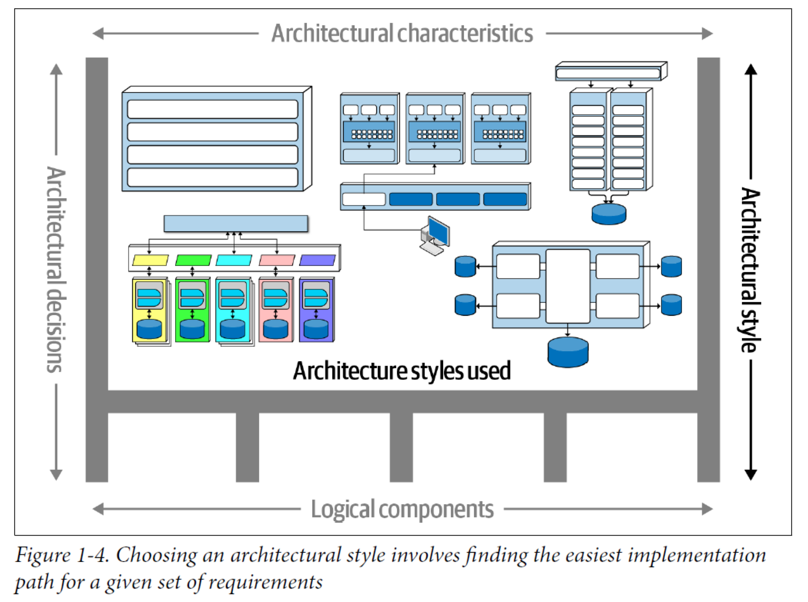

# Chapter 1: Introduction

Software architecture lacks a single agreed-upon definition, but this chapter establishes a practical framework built on four dimensions, three fundamental laws, and eight expectations for architects.

---

## Key Concepts

- **Architecture style** — the overarching structural pattern of a system (e.g., layered, microservices).
- **Architecture characteristics** — the "-ilities" that define what a system must support (e.g., scalability, availability).
- **Logical components** — the building blocks that define system behavior (domains, entities, workflows).
- **Architecture decisions** — the rules and constraints that govern how the system is constructed.
- **Trade-off** — every architectural choice has benefits and costs; there are no free lunches.

---

## Defining Software Architecture

The software architecture of a system consists of four dimensions:

### 1. Architecture Style

The starting point for any architecture. It defines the overall structure and interaction patterns of the system. Examples include layered, microservices, event-driven, etc. (covered in depth in later chapters).

### 2. Architecture Characteristics

Define the **capabilities** of a system — commonly abbreviated as "-ilities" — and the criteria for its success. In short, *what the system should do* beyond its functional requirements.

Examples: Availability, Reliability, Testability, Scalability, Security, Agility, Fault Tolerance, Elasticity, Recoverability, Performance, Deployability, Learnability.

### 3. Logical Components

While architecture characteristics define a system's capabilities, **logical components define its behavior**. They form the domains, entities, and workflows of the application — the actual building blocks that implement business logic.

### 4. Architecture Decisions

Define the **rules** for how a system should be constructed. They act as constraints that guide development teams.

> For example, an architect might make a decision that only the Business and Services layers within a layered architecture can access the database.

---

## Laws of Software Architecture

### First Law

> Everything in software architecture is a trade-off.

**Corollary 1:** If you think you've discovered something that isn't a trade-off, more likely you just haven't identified the trade-off... yet.

**Corollary 2:** You can't just do trade-off analysis once and be done with it. Trade-offs shift as the system, team, and business evolve.

### Second Law

> Why is more important than how.

An architect who can explain *why* a decision was made provides far more value than one who only specifies *how* to build it. The "why" captures intent and makes decisions revisitable when context changes.

### Third Law

> Most architecture decisions aren't binary but rather exist on a spectrum between extremes.

Rarely is the answer a hard "yes" or "no" — instead, it falls somewhere on a continuum. Recognizing this avoids false dichotomies and leads to more nuanced decisions.

---

## Expectations of an Architect

Eight core expectations for any software architect, irrespective of role, title, or job description:

| # | Expectation | What it means |
|---|-------------|---------------|
| 1 | **Make architecture decisions** | Guide rather than dictate technology choices; define the constraints, not the implementation |
| 2 | **Continually analyze the architecture** | Assess how well the current architecture meets current and future needs |
| 3 | **Keep current with latest trends** | Stay informed without chasing every new technology |
| 4 | **Ensure compliance with decisions** | Verify that teams follow the architecture decisions and constraints |
| 5 | **Diverse exposure** | Understand a broad range of technologies, frameworks, platforms, and environments |
| 6 | **Know the business domain** | Domain knowledge is essential to making sound architecture decisions |
| 7 | **Interpersonal skills** | Lead teams, facilitate discussions, and navigate disagreements |
| 8 | **Navigate politics** | Understand and work within organizational dynamics to get decisions approved and adopted |

> **Succeeding as a software architect depends on understanding and living up to each of these expectations.**

---

## Review Questions

1. What are the four dimensions that define software architecture according to the book?
2. Why does the First Law state that *everything* is a trade-off? Can you think of an example?
3. What is the difference between architecture characteristics and logical components?
4. Why is "why" more important than "how" when making architecture decisions?
5. Which of the eight architect expectations do you think is most often overlooked, and why?
