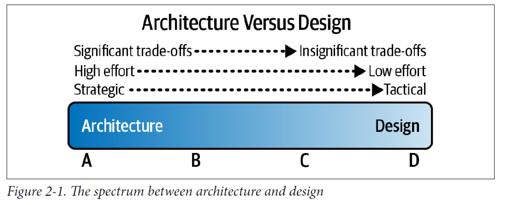
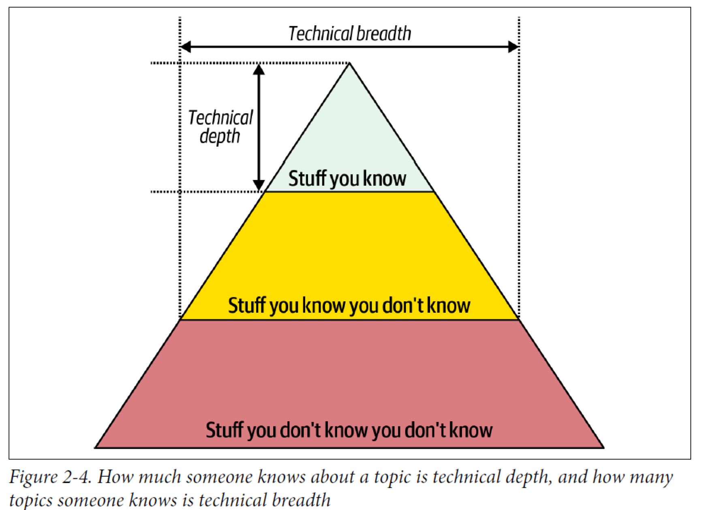
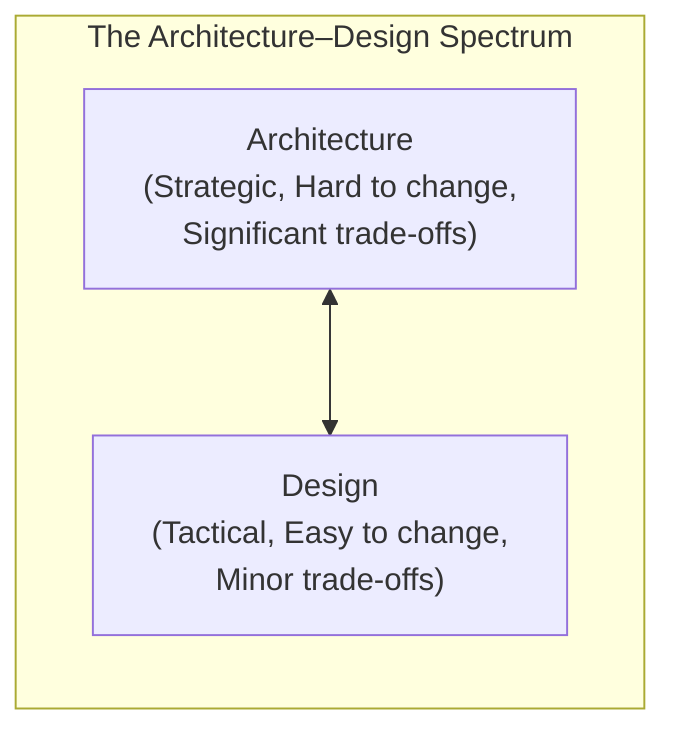
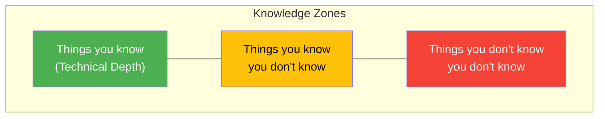

# Chapter 2: Architectural Thinking

Knowing the difference between architecture and design — and learning to think like an architect rather than a developer — is the foundation for every concept in the rest of the book.

---

## Key Concepts

- **Architectural thinking** — the ability to see things from an architectural point of view: understanding the difference between architecture and design, developing technical breadth, analyzing trade-offs, and understanding business drivers.
- **Architecture vs. Design** — architecture and design exist on a spectrum; they are not separate disciplines but rather different ends of a continuum defined by strategic impact, effort to change, and significance of trade-offs.
- **Technical depth** — deep expertise in a specific technology, language, framework, or platform.
- **Technical breadth** — broad awareness across many technologies — knowing *that something exists* and *what problems it solves*, even without hands-on mastery.
- **The Frozen Caveman Anti-Pattern** — an architect who clings to outdated experience and applies it universally, regardless of how technology has evolved.
- **The Bottleneck Trap** — an anti-pattern where an architect owns critical-path code and becomes a bottleneck because they cannot dedicate full-time development effort.
- **Technology Radar** — a living document (pioneered by ThoughtWorks) used to assess the risks and rewards of existing and emerging technologies.

---

## Deep Dive

### Architecture Versus Design

Architecture and design are not two separate things — they exist on a **spectrum**. Three factors determine where a given decision falls on that spectrum:

#### Strategic vs. Tactical Decisions

**Strategic decisions** are long-term and affect the overall direction of a system. **Tactical decisions** are short-term and usually independent of other actions. The more strategic a decision, the more architectural it is.

#### Level of Effort to Change

The harder something is to change after implementation, the more it leans toward the architectural side. A database engine choice (hard to reverse) is more architectural than a UI color scheme (easy to change).

#### Significance of Trade-Offs

The more significant the trade-offs involved, the more architectural the decision tends to be. Choosing between eventual consistency and strong consistency affects the entire system; choosing a logging library does not.

> The key takeaway: there is no clear dividing line between architecture and design. Architects and developers must collaborate across this spectrum, not work in silos.

---

### Technical Breadth

As a developer, the emphasis is on **technical depth** — mastering a language, framework, or platform deeply. As an architect, the emphasis shifts toward **technical breadth** — knowing a wide range of technologies at a sufficient level to make informed decisions about which solutions fit which problems.

The book describes three zones of knowledge:

| Zone | Description |
|------|-------------|
| **Things you know** | Technologies you have deep expertise in (technical depth) |
| **Things you know you don't know** | Technologies you are aware of but lack expertise in |
| **Things you don't know you don't know** | Technologies you are not even aware exist |

An architect's goal is to **shrink the third zone** — turning unknowns into known unknowns — so they can recognize when a solution exists even if they haven't used it personally. This does not mean abandoning depth entirely, but rather balancing it with breadth.

#### The Frozen Caveman Anti-Pattern

This anti-pattern describes an architect who had a traumatic or formative experience with a past technology and now applies that outdated lesson to every new situation — like a caveman thawed from ice who still fears saber-toothed tigers. The antidote is maintaining technical breadth: staying current prevents clinging to stale assumptions.

---

### The 20-Minute Rule

A practical technique for building technical breadth: dedicate **20 minutes every morning** to learning — before checking email, before the day's distractions begin.

> Get your 20 minutes in while your mind is fresh and before distractions take over.

**Recommended resources:**
- [InfoQ](https://www.infoq.com) — articles and presentations on emerging trends
- [ThoughtWorks Technology Radar](https://www.thoughtworks.com/radar) — curated assessment of technologies
- [DZone Refcardz](https://dzone.com/refcardz) — quick-reference guides on a wide range of topics

---

### Developing a Personal Radar

> Ignore the march of technology at your peril.

A **technology radar** is a living document to assess the risks and rewards of existing and emerging technologies. ThoughtWorks pioneered this concept, and the book encourages every architect to build their own personal version.

#### The ThoughtWorks Technology Radar

The radar is organized in two dimensions:

**Four Quadrants** (what kind of technology):

| Quadrant | Scope |
|----------|-------|
| **Tools** | Development tools (IDEs), build tools, enterprise integration tools |
| **Languages and Frameworks** | Programming languages, libraries, and frameworks (typically open source) |
| **Techniques** | Practices that assist software development: processes, engineering practices, advice |
| **Platforms** | Databases, cloud vendors, operating systems, and other technology platforms |

**Four Rings** (what action to take):

| Ring | Meaning |
|------|---------|
| **Hold** | Don't start anything new with this technology. Fine for existing projects, but avoid for new development. |
| **Assess** | Worth exploring to understand how it might fit your organization. Research it, but don't commit to it yet. |
| **Trial** | Worth pursuing. Pilot it on a low-risk project to gain real experience. |
| **Adopt** | Strongly recommended for industry adoption. Proven and reliable. |

---

### Analyzing Trade-Offs

Trade-off analysis is at the heart of architectural thinking. Unlike coding problems that often have a single correct answer, architecture decisions involve choosing between competing concerns where every option has both benefits and costs.

> "Architecture is the stuff you can't Google or ask an LLM about."
> — Mark Richards

> "There are no right or wrong answers in architecture — only trade-offs."
> — Neal Ford

An architect must develop the ability to evaluate trade-offs across dimensions like performance vs. scalability, consistency vs. availability, simplicity vs. flexibility, and communicate the reasoning behind their choices clearly.

---

### Understanding Business Drivers

Thinking like an architect means understanding the **business drivers** that determine the success of a system and translating them into **architecture characteristics** (e.g., scalability, performance, availability). This requires:

- Some level of **business-domain knowledge**
- **Collaborative relationships** with key business stakeholders
- The ability to bridge the gap between business needs and technical solutions

Without this understanding, an architect risks building a technically elegant system that fails to serve the business.

---

### Balancing Architecture and Hands-On Coding

Architects must stay technical, but the **Bottleneck Trap** anti-pattern shows what happens when this goes wrong:

**The problem:** An architect takes ownership of critical-path code (framework code, complex components) but cannot dedicate full-time development effort — they're splitting time between coding, meetings, and architecture duties. The team gets blocked waiting on the architect.

**The solution:** Delegate critical-path code to the development team and instead focus on coding a **minor piece of business functionality** one to three iterations ahead.

**The results:**

| Benefit | Why it matters |
|---------|---------------|
| Architect gains hands-on experience | Writes production code without becoming a bottleneck |
| Critical code goes to the team | Team owns and understands the hardest parts of the system |
| Architect writes business code | Stays close to what the development team actually experiences day-to-day |

#### Techniques for Staying Technical

- **Frequent proofs-of-concept (POCs)** — validate architectural decisions with working code before committing to them.
- **Tackle technical debt** — pick up debt items that other developers avoid; this deepens understanding of the codebase.
- **Fix bugs** — working through bugs provides insight into how the system actually behaves under real conditions.
- **Automate** — create tools, scripts, or pipelines that improve the team's workflow and keep your coding skills sharp.
- **Do code reviews** — reviewing others' code builds breadth and keeps you connected to what the team is building.

---

## Diagrams

---

## Practical Examples

- **Architecture vs. Design in practice:** Choosing microservices over a monolith is an *architectural* decision (strategic, hard to reverse, significant trade-offs). Choosing which HTTP client library a single service uses is a *design* decision (tactical, easy to swap, minor trade-offs).
- **Technical breadth in action:** A developer who only knows Java might reach for a JMS-based messaging solution. An architect with broad awareness might recognize that Apache Kafka is better suited for the event-streaming requirements — not because they've used Kafka deeply, but because they *know it exists and what it's for*.
- **The Bottleneck Trap in real life:** An architect who insists on writing the authentication framework themselves, while also attending four hours of meetings daily, creates a situation where the team waits days for code reviews and merges on the auth module.

---

## Connections

- **Chapter 1 — First Law of Software Architecture:** This chapter's section on analyzing trade-offs is the practical application of the First Law ("Everything in software architecture is a trade-off").
- **Chapter 1 — Expectations of an Architect:** Expectations #3 (keep current with trends), #5 (diverse exposure), and #6 (know the business domain) map directly to the concepts of technical breadth, the personal radar, and understanding business drivers discussed here.
- **Chapter 3 — Modularity:** Architectural thinking sets the mindset; modularity (next chapter) provides the first concrete tool for applying it.
- **Chapter 4 — Architecture Characteristics:** The "understanding business drivers" section foreshadows how business needs translate into architecture characteristics, covered in depth in Chapter 4.

---

## Review Questions

1. What three factors determine where a decision falls on the architecture-vs-design spectrum?
2. Why should an architect prioritize technical breadth over technical depth, and what risks come with losing depth entirely?
3. What is the Frozen Caveman Anti-Pattern, and how does the 20-Minute Rule help prevent it?
4. Explain the Bottleneck Trap anti-pattern and the book's recommended solution.
5. Why is understanding business drivers an essential part of architectural thinking, not just a "nice to have"?
